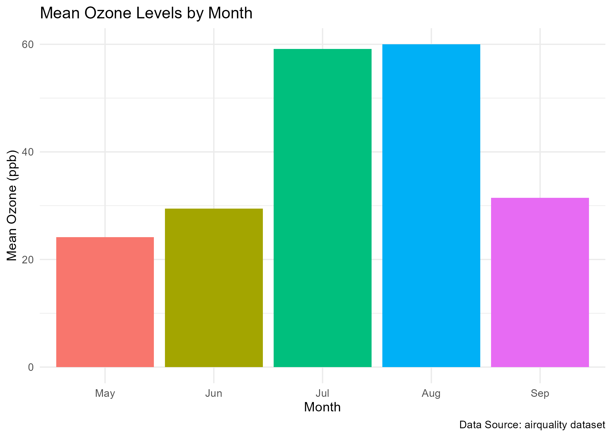
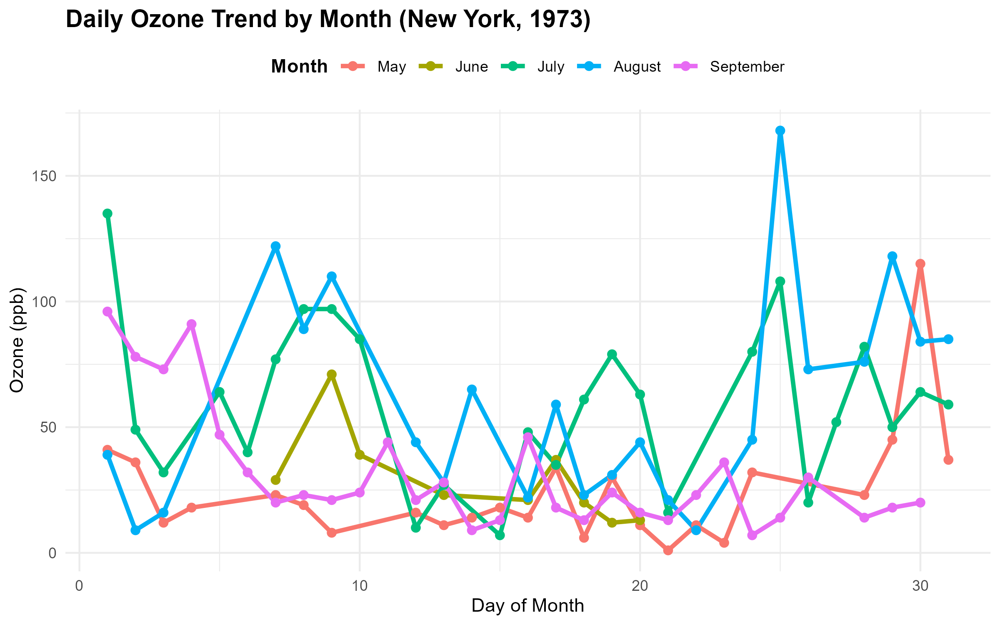
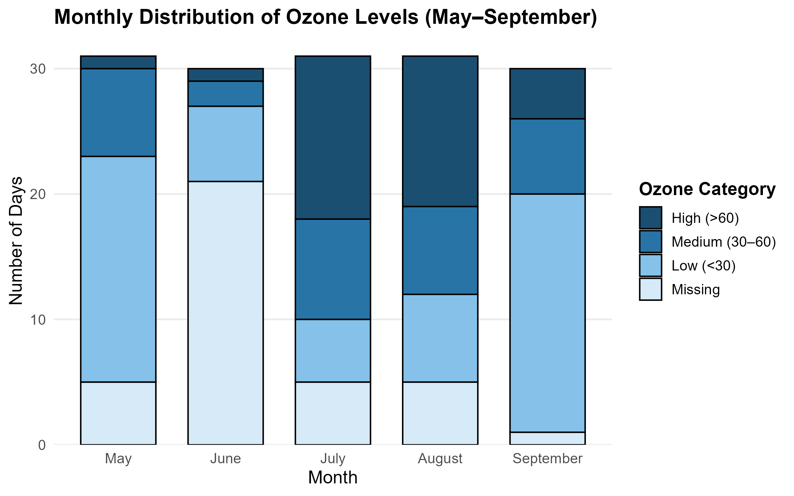
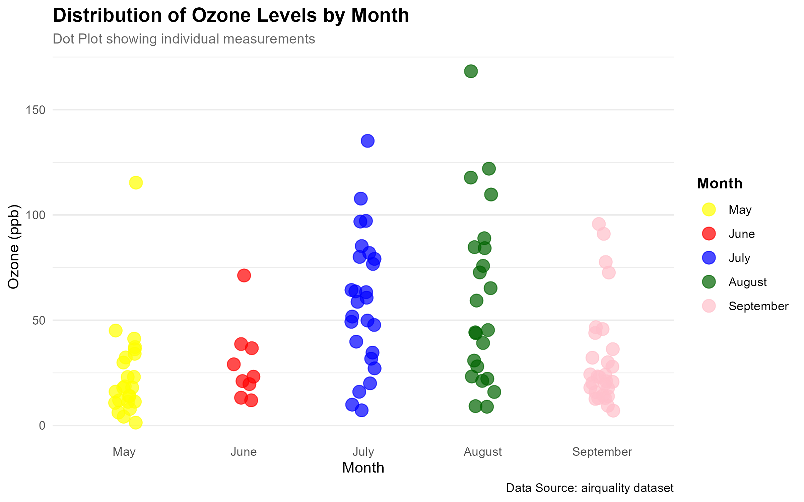

# Team Details

| Name | Roll No | Visualization Type |
|------|----------|--------------------|
| Esha Kambli | 2301 | Pie Chart |
| Deversh Shetgaonkar | 2302 | Box Plot |
| Sahil Gaonkar | 2305 | Stacked Bar Chart |
| Prabhanjan Halvegar | 2306 | Line Chart |
| Atharv Gawas | 2313 | Dot Chart |
| Aarchi Teli | 2318 | Histogram |
| Sarvadhnya Patil | 2321 | Bar Chart |
| Harsh Palyekar | 2329 | Scatter Chart |

# Dataset Description

The **airquality** dataset contains daily air quality measurements in New York from May–September 1973.  
Variables include:

| Variable | Description |
|-----------|--------------|
| Ozone | Ozone concentration (ppb) |
| Solar.R | Solar Radiation (lang) |
| Wind | Wind speed (mph) |
| Temp | Temperature (°F) |
| Month | Month of measurement |
| Day | Day of measurement |

# Project Overview

This collaborative lab demonstrates **multiple R visualization techniques**.  
Each team member contributed one unique visualization.  
All plots were saved in the `images/` folder and are displayed below with explanations.

# Visualizations

## 1. Pie Chart – *Esha Kambli (2301)*

{width=80%}

**Explanation:**  
- Shows the percentage contribution of **average Ozone levels by month**.  
- Highlights which month had the highest ozone concentration.  
- Uses a custom color palette for clarity.

---

## 2. Bar Chart – *Sarvadhnya Patil (2321)*

{width=80%}

**Explanation:**  
- Bar chart of **mean Ozone levels across months**.  
- Includes legends, axis labels, and title.  
- Highlights monthly comparisons of ozone concentrations.

---

## 3. Line Chart – *Prabhanjan Halvegar (2306)*

{width=80%}

**Explanation:**  
- Shows **daily Ozone trend by month**.  
- Allows observing fluctuations over days and identifying patterns.  
- Lines are color-coded by month for better visual distinction.

---

## 4. Stacked Bar Chart – *Sahil Gaonkar (2305)*

{width=80%}

**Explanation:**  
- Displays **number of days per month in different Ozone categories**: Low, Medium, High, Missing.  
- Stacked bars make it easy to compare categories across months.  
- Color gradient helps visually distinguish ozone levels.

---

## 5. Histogram – *Aarchi Teli (2318)*

{width=80%}

**Explanation:**  
- Histogram shows **frequency distribution of Ozone levels**.  
- Red dashed line marks the **mean Ozone level**.  
- Helps to identify the distribution pattern and outliers.

---

## 6. Dot Chart – *Atharv Gawas (2313)*

{width=80%}

**Explanation:**  
- Displays **individual Ozone measurements for each month**.  
- Uses jitter to avoid overlap of points.  
- Helps observe variability within months.

---

## 7. Scatter Chart – *Harsh Palyekar (2329)*

{width=80%}

**Explanation:**  
- Scatter plot of **Ozone vs Wind**.  
- Points are color-coded by month.  
- Allows seeing correlations between wind speed and ozone levels.

---

## 8. Box Plot – *Deversh Shetgaonkar (2302)*

{width=80%}

**Explanation:**  
- 4-panel boxplots of Ozone, Solar.R, Temp, Wind across months.  
- Includes **jittered points** for transparency.  
- Useful for comparing distributions and identifying outliers.

---

# Conclusion

The **airquality dataset** provides insights into New York’s atmospheric conditions during May–September 1973.  
Each visualization offers a unique perspective:

- Monthly averages, distributions, and trends.  
- Variability in measurements highlighted by dot and box plots.  
- Comparative insights via bar, stacked, and line charts.

**Submitted by:**  
*Team Data Dynamo-s*  
MSc Integrated Data Science  
Semester V, Data Science Toolkit  
